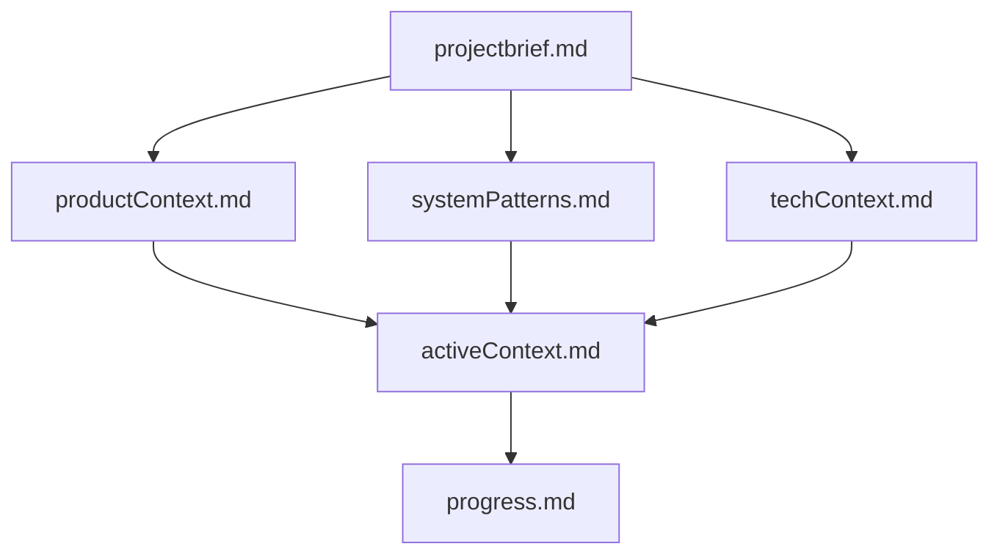

# Cline Memory Bank Templates

This repository contains a collection of Memory Bank templates designed to enhance AI assistant interactions, particularly with Cline (Claude). These structured documentation templates enable AI assistants to maintain persistent context across conversations, leading to more effective assistance for complex software projects.

## What is a Memory Bank?

A Memory Bank is a structured set of documentation files that serves as a persistent knowledge base for AI assistants. After each conversation reset or new session, the assistant reads these files to regain context about your project.

Key benefits:

- **Persistent Context**: AI assistants can maintain project knowledge across sessions
- **Structured Information**: Organized documentation helps the assistant understand project architecture, goals, and progress
- **Efficient Collaboration**: Reduces repetitive explanations and increases productive work
- **Improved Assistance**: Better code suggestions, bug fixes, and architectural guidance

## Template Collections

This repository includes three template collections:

### 1. Go Project Templates (`go-template/`)

Specialized templates for Go projects with:

- Go-specific best practices and coding standards
- Standard Go project structure guidance
- Error handling patterns for Go development
- Documentation patterns for Go packages and functions

### 2. Godot Project Templates (`gd-template/`)

Specialized templates for Godot game development projects with:

- GDScript coding standards and best practices
- Godot-specific architecture and design patterns
- Scene organization and node structure guidelines
- Resource management and signal patterns
- Additional reference files for Godot development

### 3. Standard Project Templates (`standard/`)

Language-agnostic templates for any software project:

- Generic coding standards applicable to any language
- Flexible project organization principles
- Universal documentation patterns
- General error handling and security practices

## Memory Bank Structure

Each template collection follows the same core structure:



1. **`prompt.md`** - Main memory bank prompt explaining structure and Git workflow
2. **`.clinerules`** - Project rules, styling guidelines, and best practices
3. **`projectbrief.md`** - Core requirements and goals
4. **`productContext.md`** - Problem space and solution description
5. **`systemPatterns.md`** - Architecture and design patterns
6. **`techContext.md`** - Technology stack and setup
7. **`activeContext.md`** - Current focus, recent changes, and next steps
8. **`progress.md`** - Feature progress tracking and roadmap

The Godot templates also include additional reference files:

- **`gdscript_guidelines.md`** - Detailed guidelines for GDScript coding standards
- **`godot_best_practices.md`** - Best practices for Godot game development
- **`godot_resources.md`** - Curated list of Godot documentation resources

## How to Use These Templates

1. **Choose a Template Set**:
   - Select `go-template/` for Go projects
   - Select `gd-template/` for Godot game development projects
   - Select `standard/` for other projects

2. **Create Project Directory**:

   ```bash
   mkdir -p my-project/memory-bank
   ```

3. **Copy Templates**:

   ```bash
   # For Go projects
   cp go-template/* my-project/memory-bank/
   
   # For Godot projects
   cp gd-template/* my-project/memory-bank/
   
   # For other projects
   cp standard/* my-project/memory-bank/
   ```

4. **Customize Templates**:
   - Replace placeholder text with actual project details
   - Add project-specific information to each file
   - Remove any sections not relevant to your project

5. **Reference in AI Conversations**:
   - Direct Cline (or another AI assistant) to read these files at the beginning of sessions
   - Keep the files updated as your project evolves

## Best Practices

- Keep Memory Bank files updated with project progress
- Document all major decisions and changes
- Commit Memory Bank updates alongside code changes
- Be specific and concrete rather than vague
- Include examples and code snippets when relevant

## Public Use and Contributions

This repository is provided for public use. Feel free to:

- Fork and adapt these templates for your own projects
- Create your own specialized templates for different languages or frameworks
- Share improvements or additional template collections

Pull requests with improvements or new template collections are welcome.

## License

These templates are available under the Apache License 2.0. See the LICENSE file for details.
