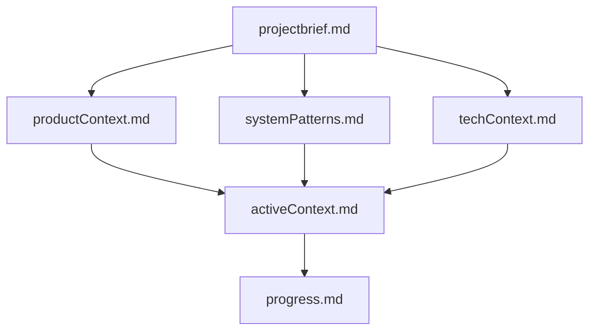

# Project Memory Bank Templates

This directory contains template files for setting up a structured Memory Bank for any software project. These templates provide a standardized way to document project context, technical decisions, and progress tracking.

## Overview

The Memory Bank structure follows a hierarchical approach where files build upon each other to provide a complete picture of the project. This approach helps Cline (or other LLM assistants) understand the project thoroughly and provide more accurate assistance.

## Memory Bank Files

1. **`prompt.md`** - The main memory bank prompt that explains the structure and Git workflow rules
2. **`.clinerules`** - Project-specific rules, styling guidelines, and best practices
3. **`projectbrief.md`** - Core requirements, goals, and project scope
4. **`productContext.md`** - Purpose, problems solved, and expected behavior
5. **`systemPatterns.md`** - Architecture, technical decisions, and design patterns
6. **`techContext.md`** - Technology stack, dependencies, and deployment details
7. **`activeContext.md`** - Current focus, recent changes, and next steps
8. **`progress.md`** - Tracks completed work, in-progress features, and planned roadmap

## How to Use These Templates

1. **Create Project Directory**:
   ```bash
   mkdir -p my-project/memory-bank
   ```

2. **Copy Templates**:
   ```bash
   cp standard/* my-project/memory-bank/
   ```

3. **Customize Templates**:
   - Replace all placeholder text (e.g., `[Project Name]`, `[Feature 1]`) with actual project details
   - Add project-specific information to each file
   - Remove sections that aren't relevant to your project
   - Update language-specific references based on your project's programming language

4. **Update as Project Evolves**:
   - Keep the memory bank files updated as the project progresses
   - Document significant changes, decisions, and progress

## File Relationships

The Memory Bank files follow this relationship structure:



## Best Practices

1. **Keep Documentation Updated**:
   - Update memory bank files regularly as the project evolves
   - Document major decisions and changes immediately

2. **Be Specific**:
   - Avoid vague descriptions
   - Include concrete examples and implementation details
   - Link to specific code files when applicable

3. **Follow Project Best Practices**:
   - Adhere to the code styling rules in `.clinerules`
   - Document exported functions, types, and packages
   - Maintain clear project structures as outlined in `systemPatterns.md`

4. **Track Progress Diligently**:
   - Keep `progress.md` up to date with completed features
   - Document known issues and their priority
   - Update milestone targets as schedules change

5. **Git Integration**:
   - Follow the Git workflow rules in `prompt.md`
   - Commit memory bank updates alongside code changes
   - Use the recovery techniques described if code is lost

## Template Usage Tips

- Start by defining the core project information in `projectbrief.md` and `productContext.md`
- Fill in technical details in `systemPatterns.md` and `techContext.md`
- Use `activeContext.md` as a living document for current focus areas
- Update `progress.md` as features are completed or new ones are planned

By maintaining these memory bank files, you'll create a comprehensive knowledge base that helps both developers and AI assistants understand and contribute to your project more effectively.
