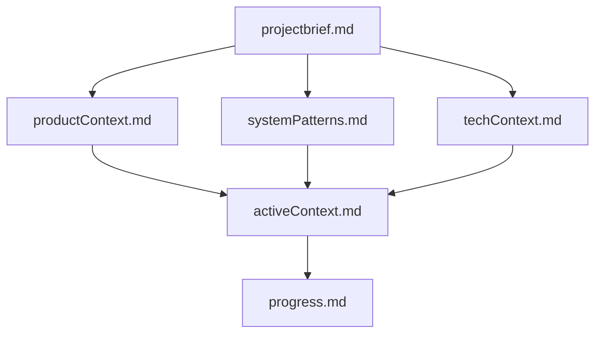
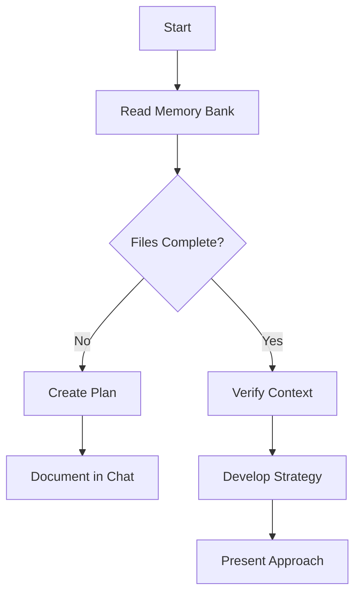
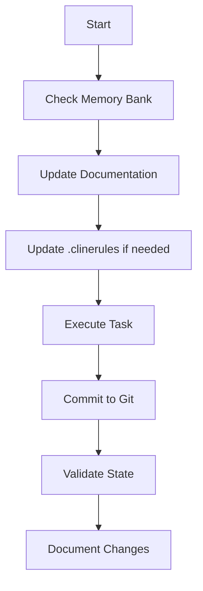

# Project Memory Bank

This memory bank system enables AI assistants to maintain persistent context for complex projects. It provides structured documentation that's critical for understanding project architecture, design decisions, and current development state.

After each conversation reset or new session, the AI assistant will **RELY COMPLETELY** on this Memory Bank to understand the project and continue effective assistance. The assistant **MUST READ ALL** memory bank files at the start of **EACH NEW TASK** without exception. The assistant should also perform **initial validation checks** (e.g., verifying file access, confirming project structure) to identify potential issues before proceeding with any work.

---

## **Git Workflow Rules – With Recovery**
- **AFTER every meaningful change, the assistant MUST commit the code to Git.**
- **IF code is lost due to a reset, mistake, or corruption, the assistant MUST attempt to restore it using Git commands before continuing new work.**
- **The assistant MUST NOT proceed with new changes if recovery is required—restoring code takes priority.**

---

## **Core Git Commands for Safe Workflow**

### **1. Standard Workflow:**
1. **Create a new feature branch before making changes:**
   ```bash
   git checkout -b feature-xyz
   ```
2. **Commit every meaningful change:**
   ```bash
   git add .
   git commit -m "Implemented [feature/bugfix description]"
   ```
3. **Merge when work is complete:**
   ```bash
   git checkout main
   git merge feature-xyz
   git push origin main
   ```

---

### **2. Recovering Lost Work**

If **code is lost**, the AI assistant MUST recover it using these steps **before proceeding** with any new work:

#### **Step 1: Check Local History (`git reflog`)**
- **Find the last known commit before loss:**
   ```bash
   git reflog
   ```
   Example output:
   ```
   e98a1b2 HEAD@{0}: commit: Fixed login issue
   d3f4a5c HEAD@{1}: commit: Added API auth
   c2b3d4a HEAD@{2}: checkout: moving from feature-x to main
   ```
- If code was lost, the assistant MUST reset or check out a previous version:
   ```bash
   git reset --hard HEAD@{1}  # Roll back to the previous commit
   ```
   OR:
   ```bash
   git checkout e98a1b2 -- path/to/file.ext  # Restore a specific file
   ```

---

#### **Step 2: Check for Uncommitted Changes (`git fsck`)**
- If changes were never committed, the assistant MUST check for dangling objects:
   ```bash
   git fsck --lost-found
   ```
   - Then look inside `.git/lost-found/other` for recoverable code.

---

#### **Step 3: Compare Differences (`git diff`)**
- If parts of the code seem missing, the assistant MUST check what changed:
   ```bash
   git diff HEAD~1 HEAD
   ```
   OR find specific changes:
   ```bash
   git log -p -1
   ```
   - If the diff shows the lost code, the assistant MUST manually restore it.

---

#### **Step 4: Restore from Recent Commits (`git cherry-pick`)**
- If a lost change was in a commit but is no longer in the working directory, the assistant MUST reapply it:
   ```bash
   git cherry-pick e98a1b2
   ```

---

### **Automatic Recovery Rules**
1. **Before modifying existing code, the assistant MUST check `git status`.**
2. **If loss occurs, the assistant MUST use `git reflog`, `git fsck`, `git diff`, and `git cherry-pick` to restore lost work.**
3. **If no commit history exists, the assistant MUST investigate `.git/lost-found` for fragments.**
4. **Only AFTER verifying full recovery can the assistant proceed with new work.**

---

## **Memory Bank Structure**

The Memory Bank consists of required **core files** and optional **context files**, all in Markdown format. Files build upon each other in a clear hierarchy:



### **Core Files (Required)**
1. **`projectbrief.md`** – Defines **core requirements and goals**  
2. **`productContext.md`** – Describes **purpose, problems solved, and expected behavior**  
3. **`activeContext.md`** – **Current focus, recent changes, next steps**  
4. **`systemPatterns.md`** – Defines **architecture, key technical decisions, and design patterns**  
5. **`techContext.md`** – Specifies hosting environment and deployment pipelines  
6. **`progress.md`** – Tracks **what works, what's left, and known issues**  

---

## **Core Workflows**

### **Plan Mode**


### **Act Mode**


---

## **Final Notes**
- **The assistant MUST read and verify the Memory Bank before executing changes.**
- **The assistant MUST document ALL major changes.**
- **The assistant MUST commit to Git for every meaningful change.**
- **The assistant MUST use advanced Git recovery (`reflog`, `fsck`, `diff`, `cherry-pick`) to restore lost work.**
- **The assistant MUST NOT proceed with new work until previous work is fully recovered and validated.**

---
